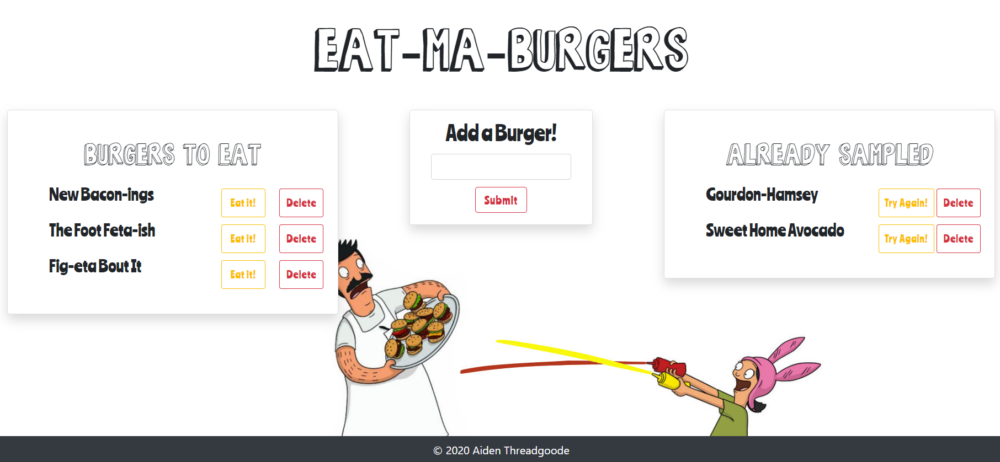

# Eat-Ma-Burgers
[](https://choosealicense.com/licenses/mit/)



    
## Description

***Eat-Ma-Burgers!*** is a restaurant app that lets users input the names of burgers they'd like to eat. When the user inputs a burger name, it is displayed on the left side, under "Burgers to Eat" with buttons enabling the user to `Try it!` or `Delete` it if they don't like it. When the user clicks `Try it!` the burger is moved to the right side, under "Already Sampled." 

##### Deployed Link: [Check it out on Heroku!](https://eat-ma-burgers.herokuapp.com/)

---

#### Table of Contents
- [Description](#description)
- [User Story](#user)
- [Usage](#usage)
- [Demo](#demo)
- [Technologies Used](#technologies)
- [Source](#sources)
- [License](#license)
- [Questions](#questions)

---

### User Story

```
AS A USER, I want to be able to add, save and try out burger ideas

I WANT to be able to be able delete the burgers that I've written

SO THAT I can keep coming up with fresh burger specials!
```

### Usage
Fee free to add new burger specials, try out any that catch your eye and if you create something you don't love, don't worry, you can delete it!


### Demo 
*Demo to come!*

### Technologies Used
- NodeJs
- ExpressJs
- MySQL & MySQL2
- Express Handlebars

#### Sources
- ["Bob's Burgers Font" by Jade Garrow](https://www.urbanfonts.com/fonts/Bob_s_Burgers.font)

#### License
This project is licensed under MIT. 

#### Questions
    
If you have any questions, please [email me.](mailto:aiden.threadgoode@gmail.com)

If you'd like to see more of my work, feel free to check out [my github!](https://github.com/a-thread)

*© 2020 Aiden Threadgoode*
    